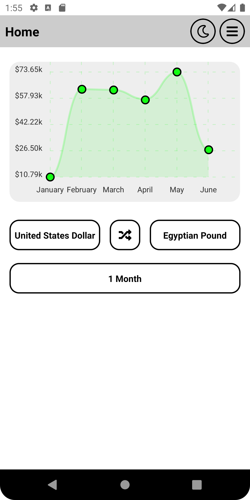
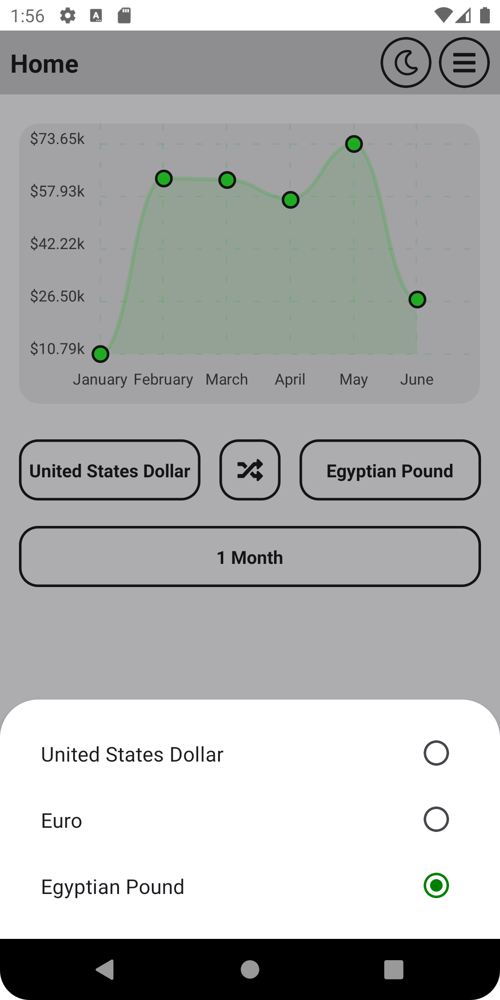
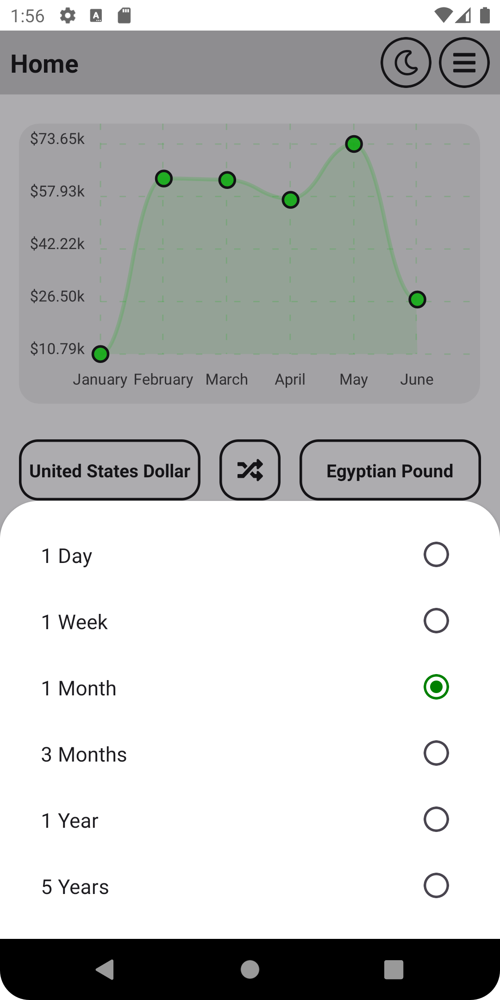
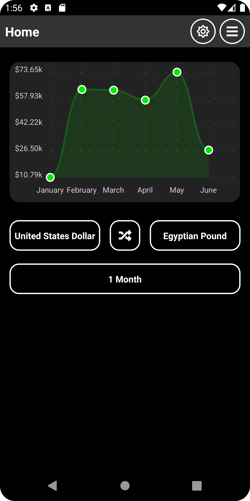
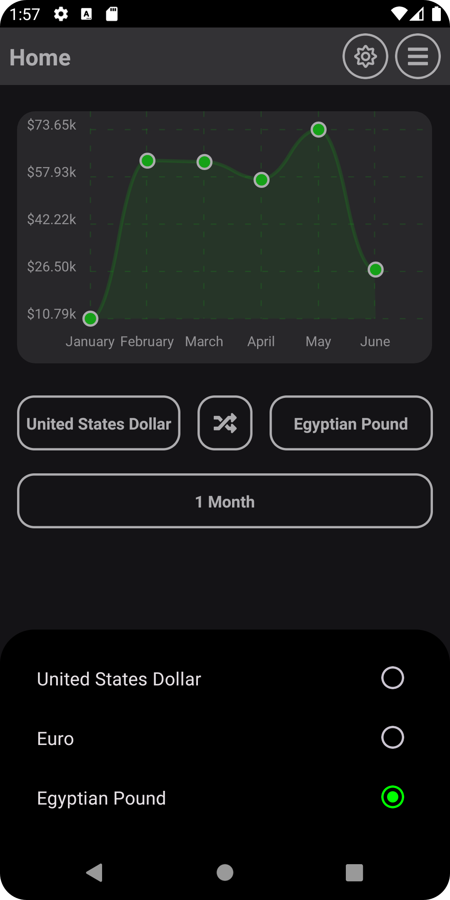
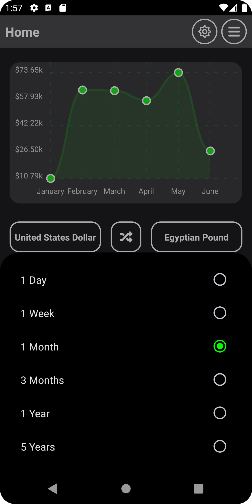
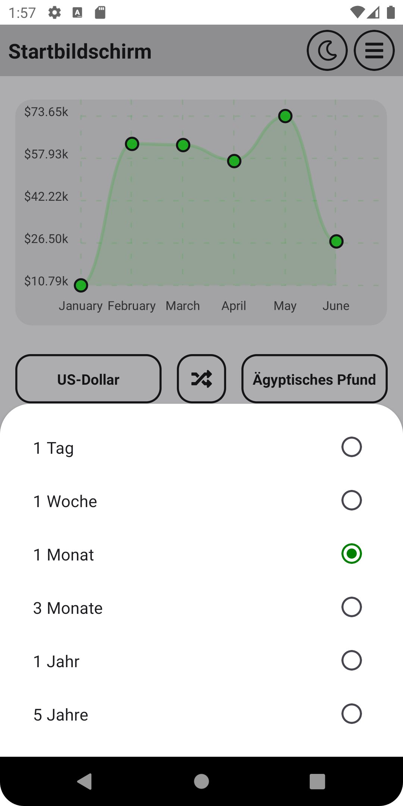
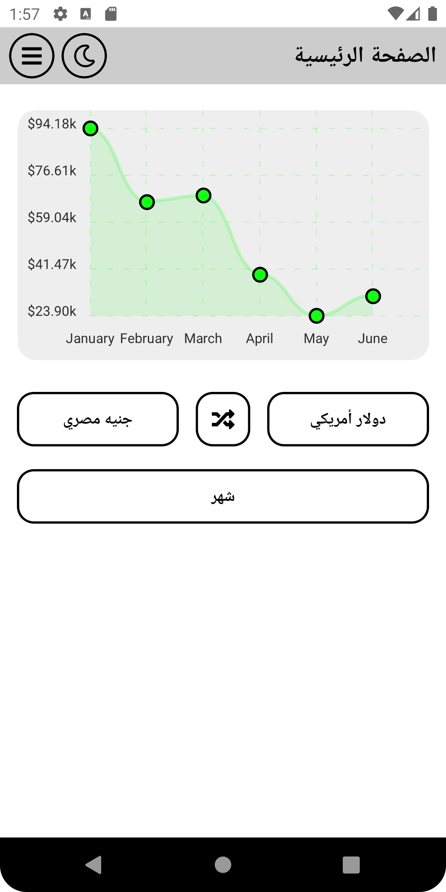

# React-Native-Currency-Exchange-App

A project for currency exchange using React Native

# A) Links:

<table>
<tr>
<th>Website</th>
<th>Link</th>
</tr>
<tr>
<td>Github Repo</td>
<td><a href="https://github.com/OmarThinks/React-Native-Currency-Exchange-App">https://github.com/OmarThinks/React-Native-Currency-Exchange-App</a></td>
</tr>
<tr>
<td>TouTube</td>
<td>https</td>
</tr>
</table>

# B) Features:

### 1) Selecting currencies:

### 2) Selecting Duration:

### 3) Theming:

### 4) Multi-Languages support:

# C) About:

This is the frontend for an app that displays currency exchange prices.

# D) Technologies Used:

1. React
2. React Native CLI
3. React Native Paper
4. Redux
5. NativeWind
6. react-native-chart-kit
7. TypeScript
8. Module Resolver
9. react-i18next

# E) Limitation:

The chart is just an empty chart.  
The main feature of the app is not working, which is rendering the historical data of exchange prices.  
That's because I couldn't find a free API that gives me historical prices.  
These examples:

1. https://coinmarketcap.com/api/pricing/
   The free tier is without historical data

2. https://www.coinapi.io/market-data-api/pricing
   Free Tier daily requests is 100 only, which is not suffiecient for development

3. https://fixer.io/#pricing_plan
   Free Tier daily requests is 100 only, which is not suffiecient for development
